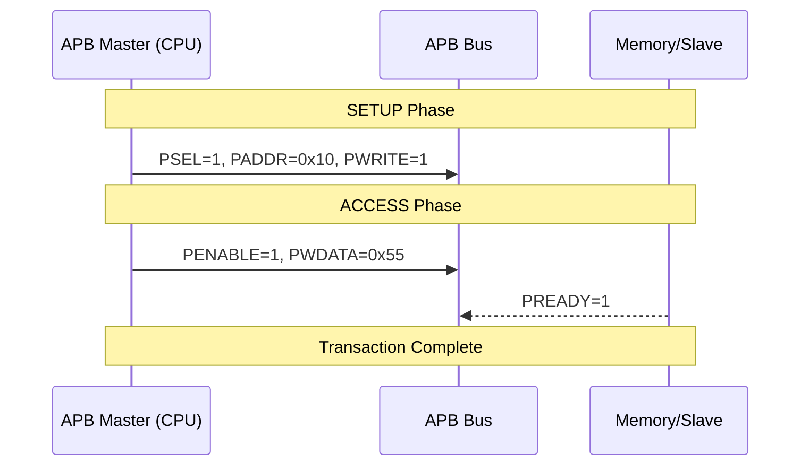
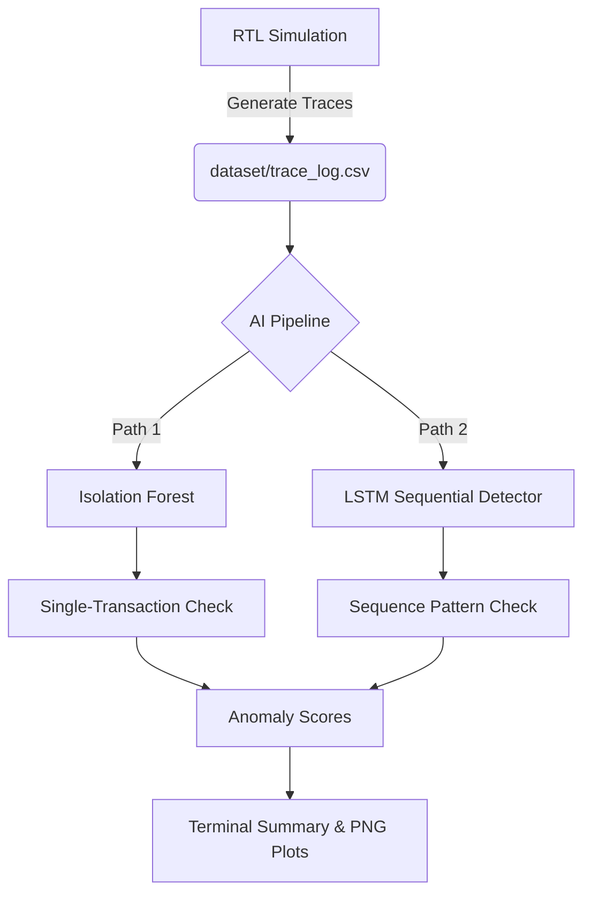

# AI-Assisted Hardware Trojan Detection: The Complete Guide

Welcome to the **Full Project Guide**. This document is designed to take you from a complete beginner ("newbee") to understanding the cutting-edge intersection of hardware security and artificial intelligence.

---

## 1. What is this Project About?

Imagine you design a high-tech chip, but because manufacturing is expensive, you send your design to a factory halfway across the world. An attacker at that factory could add a tiny, hidden circuit to your design. This is a **Hardware Trojan**.

*   **The Problem:** Trojans stay asleep during normal testing. They only wake up when a very specific "trigger" occurs (like a secret password of signals).
*   **The Goal:** Use Artificial Intelligence (AI) to watch the "heartbeat" of the chip (the bus traffic) and flag when something looks suspicious, even if we don't have a "clean" version of the chip to compare it against.

---

## 2. The Hardware Foundation: AMBA APB

The "highway" inside our chip is the **AMBA APB** (Advanced Peripheral Bus). It's a standard used by billions of devices (like your phone).

### How it Works (The Infographic)



In this project, we built a **Master** that sends data and a **Slave** that stores it.

---

## 3. Meet the "Villains": The 3 Trojan Variants

We inserted three different types of Trojans into our chip. Each one is stealthier than the last.

| Variant | Name | Trigger (The "Secret Password") | Payload (The "Attack") |
| :--- | :--- | :--- | :--- |
| **A** | The Combinational | 5 specific conditions must be met at once (Address, Data, Timing). | Corrupts data using a secret key (XOR 0xDE). |
| **B** | The Subtle | Only activates after the chip has been running for a long time. | Flips just **one single bit** of data. Very hard to see! |
| **C** | The Sequential | Only wakes up if it sees a specific **sequence** of reads (0x01 → 0x02 → 0x03). | Replaces data with all ones (0xFF). |

---

## 4. The Detection Strategy: AI to the Rescue

Traditional verification uses **Assertions** (math rules). For example: *"The address must not change mid-transfer."*
**The catch:** Our Trojans follow all the bus rules perfectly! They are "legal" but "malicious."

### The AI Flowchart



### Why "Isolation Forest"?
Think of a forest of decision trees. If a transaction is "normal," the trees have to ask many questions to find it. If a transaction is "weird" (an anomaly), the trees can isolate it very quickly. Fewer questions = higher anomaly score.

---

## 5. Feature Engineering (The Secret Sauce)

We don't just give the AI raw numbers. We create "Behavioral Features":
1.  **addr_delta:** How far did the address jump? (Sudden jumps to secret addresses are sus!)
2.  **read_write_ratio:** Is the chip suddenly reading way more than usual?
3.  **data_deviation_from_mean:** This is the most important. The AI remembers what data "usually" looks like for every address. If it suddenly changes, the AI flags it **even without a golden reference.**

---

## 6. How to Run and See Results (Local Tools Only)

### Step 1: Environment Setup
Ensure your local Python app has the necessary libraries.
```bash
python setup_env.py
```

### Step 2: Hardware Simulation
Open **ModelSim**. Run the Verilog code and create the trace logs.
```bash
# Inside ModelSim console
do sim/run_sim.do
```
Look for `[TROJAN DETECTED]` directly in the ModelSim transcript.

### Step 3: The AI Pipeline
Run the Python scripts. Results are printed as a table in your terminal.
```bash
python scripts/run_pipeline.py
```

---

## 7. Summary for Newbees

1.  **Design** a standard bus (APB).
2.  **Infect** it with 3 different "sleeping" Trojans.
3.  **Verify** it using traditional tools (they will pass, proving the Trojans are stealthy).
4.  **Extract** the bus traffic into a CSV file.
5.  **Detect** the Trojans using unsupervised AI that learns "normal" behavior.
6.  **Visualize** the results using Terminal tables and local image plots.

**This project proves that AI is a mandatory layer for modern hardware security!**
